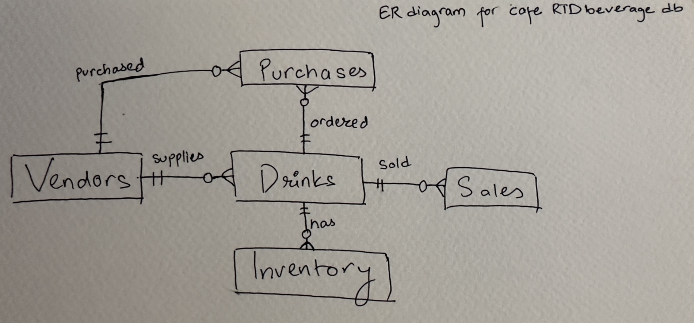

# Design Document

By Kabin Magar

Video overview: <https://youtu.be/Z99zCgGck3U>

## Scope
My database is designed for a boutique local cafe to keep track of its ready-to-drink Beverages or packaged beverages sourced from different vendors, which could be local or corporate. For example, Coke, sparking water, or organic orange juice from the local vendor. While I made this database for a boutique local cafe, it can also be used by restaurants or convenience stores. It can be scaled for larger businesses as well.

The scope for this database is:

* Drinks— Ready-to-drink (RTD) beverages or packaged drinks offered in the cafe with information like unique ID, name, cost price, selling price, and vendor ID.

* Vendors- this consists of basic vendor information like name od the seller and their contact information

* sales- keeps track of the beverages sold at the cafe, with date and quantity sold

* Purchases- consist of information like quantity purchased, with its date and vendor/item IDs.

* update_after_sale- automatically updates inventory after sales

* update_after_purchase- automatically updates after purchase

* update_after_drinks- automatically updates after adding a new drink on the drinks table

* Inventory- this consists of the quantity we have in stock

Ingredients of beverages sold at the shop or other merchandising or in-house brewed items are not in
  the scope of this database.

## Functional Requirements

With this database, you should be able to
- Perform CRUD operation on the drinks and vendor information
- Track the profit and sales of the drinks
- Track the inventory of drinks

The price changes of the products are out of this database scope. However, it is something that can be an added feature for a more advanced database.

## Representation
Entities are captured in SQLite tables with the following schema.

### Entities

The database includes the following entities:

 The drinks table consists of
 * "id," which is the primary key and unique to the individual drink.
 * "Product_name", which is the name of the product that is a TEXT, NOT NULL, and UNIQUE, so that each
    drink has its row and it is not repeated.
 *  "cost_price" is the cost of the individual product, which is a REAL number NOT NULL,
 * "selling_price" is the selling price  of the individual product, which is a REAL number and not null
 * "vendors_id" is a foreign key from the vendors table, so that we can relate it to the vendors table.

 The vendors table consists of
 * "id", which is the primary key and unique to the individual vendor,
 * "name" which is the name of the vendor or corporation that is a TEXT, NOT NULL, and UNIQUE so that
    each vendor has its row and it is not repeated,
 * "phone" which is an INTEGER NOT NULL,
 * "email" which is TEXT and not mandatory, as we have a mandatory phone number,
 * "address" which is a TEXT and not mandatory, as we have a mandatory phone number,
 * "contact_person" and not mandatory, as we have a mandatory phone number, but having a consistent contact person is easier for the business.

 The inventory table consists of
 * "id" which is the primary key and unique,
 * "drink_id" is a foreign key from drinks,
 * "quantity_in_stock", which is an integer that counts the drinks,

 The sales table consists of
 * "id" which is the primary key and unique to the sale,
 * "drink_id" is a foreign key from drinks,
 * "quantity_sold", which is the sold amount, and an INTEGER NOT NULL, as it can't sell  products
 * "sale_time" NUMERIC NOT NULL DEFAULT CURRENT_TIMESTAMP, which helps us to record the sale time and
    calculate profit at a certain time.

 The purchases table consists of
 * "id" which is the primary key and unique to the purachase of dicks
 * "drink_id" is a foreign key from drinks.
 * "vendors_id" is a foreign key from vendors,
 * "quantity_purchased" is an INTEGER NOT NULL, as we are buying at least one or more,
 * "purchase_date" NUMERIC NOT NULL DEFAULT CURRENT_TIMESTAMP, as we can track the date we buy,

### Relationships

The entity diagram has the relationship shown

* A vendor can sell 0 to many different drinks, but a drink can only have one vendor.
* There can be many drinks in the inventory, but a drink is only related to one inventory.
* A drink can have  0 to many sales, but each sale is for one drink
* A drink can have 0 to many purchases, but each purchase is for one drink
* A vendor can have 0 to many purchases, but each purchase is from one vendor

## Optimizations
I have created 3 triggers, "update_after_sale", "update_after_drinks" and "update_after_purchase", so that we can insert and update the inventory by subtracting after each sale and adding after each purchase.

## Limitations

This database does have its limitations, as we discussed previously on the scope and functional requirement that ingredients of beverages sold at the shop or other merch or in-house brewed items are not in the scope of this database, and the price changes of the products are out of this database scope. However, it is something that can be an added feature for a more advanced database. Also in this database we have one to many relations with vendor with drinks ie a vendor can provide many drinks but a drink can only have one vendor but in real life one drink can have many vendors and we can select vendor providing the cheapest option which is something that is beyond this project but it is something that can be considerd and implemented.
